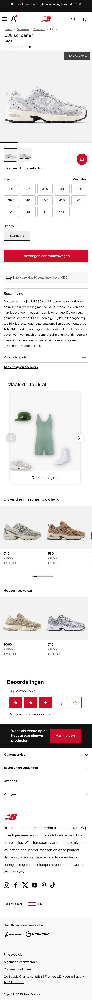
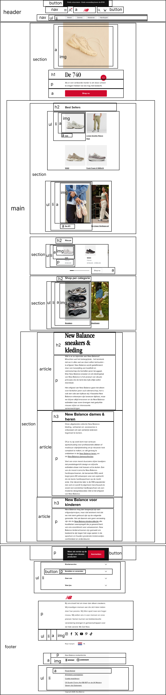
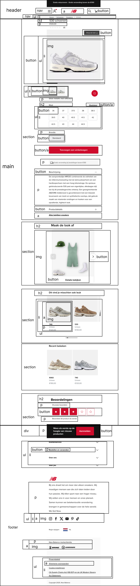

# Procesverslag
Markdown is een simpele manier om HTML te schrijven.  
Markdown cheat cheet: [Hulp bij het schrijven van Markdown](https://github.com/adam-p/markdown-here/wiki/Markdown-Cheatsheet).

Nb. De standaardstructuur en de spartaanse opmaak van de README.md zijn helemaal prima. Het gaat om de inhoud van je procesverslag. Besteedt de tijd voor pracht en praal aan je website.

Nb. Door *open* toe te voegen aan een *details* element kun je deze standaard open zetten. Fijn om dat steeds voor de relevante stuk(ken) te doen.

## Jij

  
uitwerken voor kick-off werkgroep

  ### Auteur:
  Souhaila Bachoukh

  #### Je startniveau:
  Startniveau: blauw

  #### Je focus:
  Focus: surface plane
 

## Je website

  
uitwerken voor kick-off werkgroep

  ### Je opdracht:
  [link naar de website die je gaat namaken óf de naam/omschrijving van je eigen ontwerp](https://nl.newbalance.eu/nl?cq_src=google_ads&cq_cmp=19665135109&cq_con=151667719371&cq_term=new%20balance&cq_med=&cq_plac=&cq_net=g&cq_pos=&cq_plt=gp&gclsrc=aw.ds&gad_source=1&gad_campaignid=19665135109&gbraid=0AAAAADkO1QIVu5qPdhCIhH_PQ2XnPVJg1&gclid=EAIaIQobChMIkevLvd_EjwMVEplQBh32Ew68EAAYASAAEgIltvD_BwE)

  #### Screenshot(s) van de eerste pagina (small screen): 
  hier de naam van de pagina: Schoenen en Kleding | Officiële Site - New Balance
  

  #### Screenshot(s) van de tweede pagina (small screen):
  hier de naam van de pagina: Unisex 530 schoenen - New Balance
  
 

## Toegankelijkheidstest 1/2 (week 1)

  
uitwerken na test in 2e werkgroep

  ### Bevindingen
  Lijst met je bevindingen die in de test naar voren kwamen:
  - Het is duidelijk dat je op de homepagina bent van New Balance en er een image zichtbaar is, maar je weet niet wat voor afbeelding. Ook wordt er opgenoemd dat er navigation is,maar wordt de informatie onder elk kopje niet helemaal opgelezen. 
 
  - Er wordt aangegeven bij welke heading je zit, en deze wordt opgelezen. Ook wordt aangegeven dat dat de laatste heading is op een pagina als dat zo is.

  - Een link wordt aangegeven met de naam ervan, zodat je weet dat je erop kunt klikken om naar die pagina te gaan.

  - Er wordt aangegeven dat je naar volgende slide kan gaan door middel van een button. 

  - Bij elk plaatje wordt genoemd dat het een image is en de informatie daarbij wordt ook opgenoemd, maar het gaat best snel en zorgt voor verwarring door herhaling van “new line”.

  - Kon niet navigeren naar de andere kleuren van de schoenen op de productpagina, hij sprong van de beschrijving naar maat zonder de andere opties te kunnen selecteren.

  - Zowel de maten die wel als niet op voorraad zijn worden opgenoemd.

  - De knop standaard wordt niet opgenoemd wanneer je door de pagina navigeert op de productpagina.

## Breakdownschets (week 1)

  
uitwerken na afloop 3e werkgroep

  ### de hele pagina: 
  
  

  ### dynamisch deel (bijv menu): 
  

  ### wellicht nog een dynamisch deel (bijv filter): 
  

## Voortgang 1 (week 2)

  
uitwerken voor 1e voortgang

  ### Stand van zaken
  hier dit ging goed & dit was lastig (neem ook screenshots op van delen van je website en code)
  Dit ging goed:
  - Tijdens het coderen van de HTML van de homepagina ging het coderen van de main best soepel.

  Dit was lastig:
  - De productpagina vond ik wat moeilijker om te coderen door complexere elementen die daarin zitten.
  - Ook het coderen van een hamburgermenu begrijp ik nog niet echt.

  ### Agenda voor meeting
  samen met je groepje opstellen

  | student 1      | student 2          | student 3    | student 4        |
  | ---            | ---                | ---          | ---              |
  | dit bespreken  | en dit             | en ik dit    | en dan ik dat    |
  | en dat ook nog | dit als er tijd is | nog een punt | dit wil ik zeker |
  | ...            | ...                | ...          | ...              |

  ### Verslag van meeting
  hier na afloop snel de uitkomsten van de meeting vastleggen

  - punt 1
  - punt 2
  - nog een punt
  - ...

## Voortgang 2 (week 3)

  
uitwerken voor 2e voortgang

  ### Stand van zaken
  hier dit ging goed & dit was lastig (neem ook screenshots op van delen van je website en code)

  ### Agenda voor meeting
  samen met je groepje opstellen

  | student 1      | student 2          | student 3    | student 4        |
  | ---            | ---                | ---          | ---              |
  | dit bespreken  | en dit             | en ik dit    | en dan ik dat    |
  | en dat ook nog | dit als er tijd is | nog een punt | dit wil ik zeker |
  | ...            | ...                | ...          | ...              |

  ### Verslag van meeting
  hier na afloop snel de uitkomsten van de meeting vastleggen

  - punt 1
  - punt 2
  - nog een punt
- ...

## Toegankelijkheidstest 2/2 (week 4)

  
uitwerken na test in 9e werkgroep

  ### Bevindingen
  Lijst met je bevindingen die in de test naar voren kwamen (geef ook aan wat er verbeterd is):

## Voortgang 3 (week 4)

  
uitwerken voor 3e voortgang

  ### Stand van zaken
  hier dit ging goed & dit was lastig (neem ook screenshots op van delen van je website en code)

  ### Agenda voor meeting
  samen met je groepje opstellen

  | student 1      | student 2          | student 3    | student 4        |
  | ---            | ---                | ---          | ---              |
  | dit bespreken  | en dit             | en ik dit    | en dan ik dat    |
  | en dat ook nog | dit als er tijd is | nog een punt | dit wil ik zeker |
  | ...            | ...                | ...          | ...              |

  ### Verslag van meeting
  hier na afloop snel de uitkomsten van de meeting vastleggen

  - punt 1
  - punt 2
  - nog een punt
  - ...

## Eindgesprek (week 5)

  
uitwerken voor eindgesprek

  ### Je uitkomst - karakteristiek screenshots:
  

  ### Dit ging goed/Heb ik geleerd: 
  Korte omschrijving met plaatjes

  

  ### Dit was lastig/Is niet gelukt:
  Korte omschrijving met plaatjes

  

## Bronnenlijst

  
continu bijhouden terwijl je werkt

  Nb. Wees specifiek ('css-tricks' als bron is bijv. niet specifiek genoeg). 
  Nb. ChatGpT en andere AI horen er ook bij.
  Nb. Vermeld de bronnen ook in je code.

  1. bron 1
  2. bron 2
  3. ...

