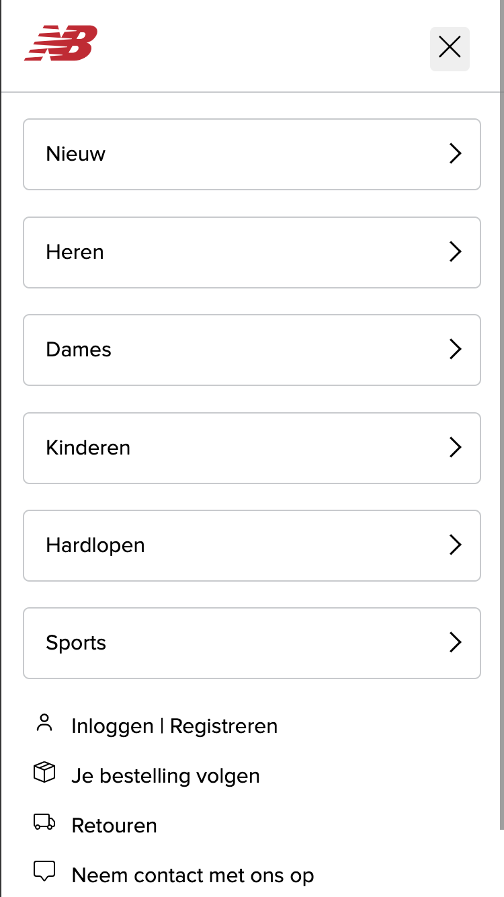

# Procesverslag
Markdown is een simpele manier om HTML te schrijven.  
Markdown cheat cheet: [Hulp bij het schrijven van Markdown](https://github.com/adam-p/markdown-here/wiki/Markdown-Cheatsheet).

Nb. De standaardstructuur en de spartaanse opmaak van de README.md zijn helemaal prima. Het gaat om de inhoud van je procesverslag. Besteedt de tijd voor pracht en praal aan je website.

Nb. Door *open* toe te voegen aan een *details* element kun je deze standaard open zetten. Fijn om dat steeds voor de relevante stuk(ken) te doen.

## Jij

  
uitwerken voor kick-off werkgroep

  ### Auteur:
  Souhaila Bachoukh

  #### Je startniveau:
  Startniveau: blauw

  #### Je focus:
  Focus: Surface Plane
 

## Je website

  
uitwerken voor kick-off werkgroep

  ### Je opdracht:
  [link naar de website die je gaat namaken óf de naam/omschrijving van je eigen ontwerp](https://nl.newbalance.eu/nl?cq_src=google_ads&cq_cmp=19665135109&cq_con=151667719371&cq_term=new%20balance&cq_med=&cq_plac=&cq_net=g&cq_pos=&cq_plt=gp&gclsrc=aw.ds&gad_source=1&gad_campaignid=19665135109&gbraid=0AAAAADkO1QIVu5qPdhCIhH_PQ2XnPVJg1&gclid=EAIaIQobChMIkevLvd_EjwMVEplQBh32Ew68EAAYASAAEgIltvD_BwE)

  #### Screenshot(s) van de eerste pagina (small screen): 
  hier de naam van de pagina: Schoenen en Kleding | Officiële Site - New Balance
  

  #### Screenshot(s) van de tweede pagina (small screen):
  hier de naam van de pagina: Unisex 530 schoenen - New Balance
  
 

## Toegankelijkheidstest 1/2 (week 1)

  
uitwerken na test in 2e werkgroep

  ### Bevindingen
  Lijst met je bevindingen die in de test naar voren kwamen:

  Screenreader test:
  - Het is duidelijk dat je op de homepagina bent van New Balance en er een image zichtbaar is, maar je weet niet wat voor afbeelding. Ook wordt er opgenoemd dat er navigation is,maar wordt de informatie onder elk kopje niet helemaal opgelezen. 
 
  - Er wordt aangegeven bij welke heading je zit, en deze wordt opgelezen. Ook wordt aangegeven dat dat de laatste heading is op een pagina als dat zo is.

  - Een link wordt aangegeven met de naam ervan, zodat je weet dat je erop kunt klikken om naar die pagina te gaan.

  - Er wordt aangegeven dat je naar volgende slide kan gaan door middel van een button. 

  - Bij elk plaatje wordt genoemd dat het een image is en de informatie daarbij wordt ook opgenoemd, maar het gaat best snel en zorgt voor verwarring door herhaling van “new line”.

  - Kon niet navigeren naar de andere kleuren van de schoenen op de productpagina, hij sprong van de beschrijving naar maat zonder de andere opties te kunnen selecteren.

  - Zowel de maten die wel als niet op voorraad zijn worden opgenoemd.

  - De knop standaard wordt niet opgenoemd wanneer je door de pagina navigeert op de productpagina.

  WCAG checklist:
  - Bij sommige knoppen is het niet duidelijk dat je erop kunt klikken.

  - de HTML heeft 50+ errors.

  - Er zijn geen duidelijke headings in de code.

  - De tab-toets gaat niet langs elk element in de website. Hij gaat niet langs de tekst op de website, niet elke image en kopjes (h1, h2, h3). Wel gaat hij langs elke button en link.

  - In de code zijn er niet echt lijstjes te zien, er wordt vooral div gebruikt in de code.

  - Bij images wordt niet altijd een alt gebruikt. Als er een alt wordt gebruikt dan is hij best onduidelijk, bijvoorbeeld alt="530". Naast alt wordt er ook veel 'title' gebruikt bij images.

  - Voor buttons wordt het 'button' element gebruikt en voor linkjes het 'a' element.

## Breakdownschets (week 1)

  
uitwerken na afloop 3e werkgroep

  ### de hele pagina: 
  

  

  ### dynamisch deel (bijv menu): 
  

  ### wellicht nog een dynamisch deel (bijv filter): 
  

## Voortgang 1 (week 2)

  
uitwerken voor 1e voortgang

  ### Stand van zaken
  Dit ging goed:
  - Tijdens het coderen van de HTML van de homepagina ging het coderen van de main best soepel.

  Dit was lastig:
  - De productpagina vond ik wat moeilijker om te coderen door complexere elementen die daarin zitten.
  - Ook het coderen van een hamburgermenu begrijp ik nog niet echt.

  ### Agenda voor meeting
  samen met je groepje opstellen

  | student 1      | student 2          | student 3    | student 4        |
  | ---            | ---                | ---          | ---              |
  | dit bespreken  | en dit             | en ik dit    | en dan ik dat    |
  | en dat ook nog | dit als er tijd is | nog een punt | dit wil ik zeker |
  | ...            | ...                | ...          | ...              |

  ### Verslag van meeting
  hier na afloop snel de uitkomsten van de meeting vastleggen

  - De images die ik bij de boordelingen had gezet, kan ik beter svg's van maken.
  - Van de producten in mijn pagina kan ik of een lijstje met li's gebruiken of er articles van maken.
  - Op de productpagina kan ik het stukje waarbij je de kleuren en maten kan kiezen het best in een form zetten met daarin een fieldset etc.
  - In de readme ook de bevindingen van de WCAG checklist zetten. 
  - Verder ziet alles er goed uit.

## Voortgang 2 (week 3)

  
uitwerken voor 2e voortgang

  ### Stand van zaken
  Dit ging goed:
  - Het gebruiken van grid en flexbox op mijn homepagina en productpagina.
  - De vormgeving van mijn website zoveel mogelijk overeen laten komen met de echte website.

  Dit was lastig:
  - Dit stuk op mijn productpagina vond ik best lastig: 
  Hier zal ik vragen over stellen tijdens het voortgangsgesprek.

  ### Agenda voor meeting
  samen met je groepje opstellen

  | student 1      | student 2          | student 3    | student 4        |
  | ---            | ---                | ---          | ---              |
  | dit bespreken  | en dit             | en ik dit    | en dan ik dat    |
  | en dat ook nog | dit als er tijd is | nog een punt | dit wil ik zeker |
  | ...            | ...                | ...          | ...              |

  ### Verslag van meeting
  hier na afloop snel de uitkomsten van de meeting vastleggen:

  - Van het lastige stukje in mijn productpagina (flipcard), kan ik het best articles maken met daarin een div van het hele kaartje en dan weer een aparte div van de voorkant en van de achterkant. Van deze div's kan ik dan weer classes maken om het makkelijker te stylen.
  - Voor de scrollbars kan ik de carousel opdracht in codepen gebruiken.
  - De breadcrumbs bovenaan in mijn productpagina kan een nav zijn met daarin een ul. 
  - De website ziet er al erg goed uit en ik ben goed opweg. 

## Toegankelijkheidstest 2/2 (week 4)

  
uitwerken na test in 9e werkgroep

  ### Bevindingen
  Lijst met je bevindingen die in de test naar voren kwamen (geef ook aan wat er verbeterd is):

  Screenreader test:
  - De screenreader leest alles op de pagina van boven tot beneden op. Dit is verbeterd ten opzichte van de echte website, omdat de screenreader op de echte website heel veel dingen oversloeg.

  - Ook het hamburgermenu wordt volledig opgelezen, ookal heb je er niet op geklikt.

  - Bij elk element wordt er opgenoemd wat het is: button, link, image, heading, nav etc.

  - Bij elke heading wordt er aangegeven wat voor heading het is: h1, h2, h3 etc.

  - Duidelijke aria-labels worden opgelezen voor meer duidelijkheid, terwijl op de echte website juist vaak verwarrende woorden worden gebruikt. 

  - De screenreader verteld vooraf hoeveel list items er zijn (in een ul) en gaat ze dan allemaal langs met alle informatie die erin staat. 

  - De elementen die in een carousel zitten worden vanzelf afgespeeld en allemaal opgenoemd. Dit is ook verbeterd, omdat de screenreader op de echte site alleen de elementen in een carousel opnoemt die in beeld zijn en daar stopt.

  - Alle tekst op de pagina's wordt ook opgelezen. Op de echte site wordt niet altijd alle tekst en andere elementen opgelezen. 

  - Bij kleur kiezen is het niet helemaal duidelijk dat je op de afbeeldingen kunt klikken, omdat het eigenlijk images zijn. 

  --> Over het algemeen vind ik dat mijn website voor screenreaders is verbeterd ten opzichte van de echte website.

  WCAG checklist:
  - De HTML bevat geen errors en is valid.

  - Voor images worden altijd alt gebruikt en zo duidelijk mogelijk voor de gebruiker. 

  - De headings zijn netjes in logische hiërarchie geordend (h1, h2, h3). Op de officiële site klopt heading-structuur soms niet of gebruiken div’s voor titels.

  - In mijn site is er een geluidje + animatie bij de winkelwagen-knop toegevoegd. Hierdoor krijgen gebruikers zowel visueel als in geluid feedback. 

  - Knoppen zonder tekst hebben duidelijke aria-labels zoals: "Menu openen", "Menu sluiten", "Zoeken", "Winkelwagen". Op de officiële site mist dit.

  - Mijn chatbot-popup bevat aria-label="Chat starten" en een duidelijke sluitknop met aria-label="Sluit helpvenster".

  - In mijn site gebruik ik <nav aria-label="Hamburgermenu"> en <nav aria-label="Categorie menu">. De echte site gebruikt alleen <nav> zonder beschrijving en is dus minder duidelijk.

  - De tab-toets gaat niet langs alle tekst op de pagina.

  - In mijn site gebruik ik list elements.

## Voortgang 3 (week 4)

  
uitwerken voor 3e voortgang

  ### Stand van zaken
  Dit ging goed:
  - De puntjes op de i zetten voor beide pagina's.
  - Beginnen aan de surface plane. 

  Dit vond ik lastig:
  - Javascript toepassen, aangezien ik het best lastig vind en ik de code simpel moet houden om te kunnen begrijpen. 

  ### Agenda voor meeting
  samen met je groepje opstellen

  | student 1      | student 2          | student 3    | student 4        |
  | ---            | ---                | ---          | ---              |
  | dit bespreken  | en dit             | en ik dit    | en dan ik dat    |
  | en dat ook nog | dit als er tijd is | nog een punt | dit wil ik zeker |
  | ...            | ...                | ...          | ...              |

  ### Verslag van meeting
  - Laatste week geen voortgangsgesprek gehad. 

## Eindgesprek (week 5)

  
uitwerken voor eindgesprek

  ### Je uitkomst - karakteristiek screenshots:
  
  
  

  ### Dit ging goed/Heb ik geleerd: 
  Korte omschrijving met plaatjes:

  Wat goed ging en wat ik heb geleerd is het toepassen van grid en flexbox op mijn eigen website:
  
  

  Ook het proberen om de vormgeving zo goed mogelijk na te coderen is uiteindelijk best goed gelukt:
  

  Ik heb ook geleerd hoe ik een werkende hamburgermenu maak:
  

  Verder heb ik ook nog geleerd hoe ik een pop up maak met dialog:
  

  ### Dit was lastig/Is niet gelukt:
  Korte omschrijving met plaatjes:

  Wat ik lastig vond was het maken van een flipcard. Uiteindelijk is het me gelukt om er eentje te maken met behulp van de studenassistent, maar niet om door te klikken naar meerdere flipcards:
  

  Het toevoegen van een nieuwe header en terugknop bij de subhamburgermenu's vond ik erg lastig en is me uiteindelijk niet gelukt:
  

## Bronnenlijst

  
continu bijhouden terwijl je werkt

  Nb. Wees specifiek ('css-tricks' als bron is bijv. niet specifiek genoeg). 
  Nb. ChatGpT en andere AI horen er ook bij.
  Nb. Vermeld de bronnen ook in je code.

  1. https://www.codeguage.com/v1/courses/html/forms-fieldsets 
  2. https://css-tricks.com/almanac/properties/p/pointer-events/ 
  3. https://developer.mozilla.org/en-US/docs/Web/CSS/list-style-type 
  4. https://pixabay.com/nl/sound-effects/search/cash/  
  5. https://icons.getbootstrap.com/icons/chat-square/  
  6. https://heroicons.com/outline  
  7. https://codepen.io/mondal10/pen/WNNEvjV 

